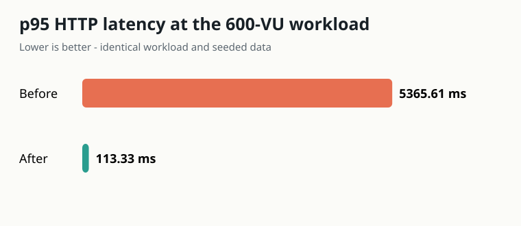
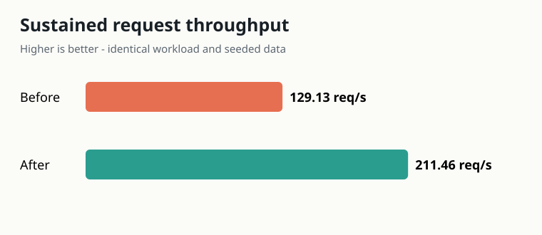

# Local performance comparison

This directory rebuilds a complete local test environment and compares the frozen original backend with the optimized replacement. It never connects to the retired API, identity provider, database, cache, or object store.

## Acceptance profile

| Setting | Value |
| --- | ---: |
| Ramp | 0 to 600 virtual users over 5 minutes |
| Steady state | 600 virtual users for 5 minutes |
| Ramp down | 600 to 0 over 1 minute |
| Think time | Random 1-3 seconds between user actions |
| p95 target | <= 300 ms |
| Request error target | < 1% |
| Throughput target | >= 100 requests/second |
| Optimized cache-hit target | >= 80% |

Each iteration calls profile, attempts one completion, loads challenges, loads one leaderboard page, and loads rewards. A virtual user updates its dorm on its first iteration. The same [`k6/journey.js`](k6/journey.js) file, stage settings, user IDs, seed scale, and host run both variants.

## Test data

[`postgres/schema-and-seed.sql`](postgres/schema-and-seed.sql) deterministically creates:

- 5,000 participant records;
- 120 challenges;
- 150,000 completion rows;
- 40,000 reward-transaction rows;
- 12 rewards.

`setup.ps1` creates separate `quest_before` and `quest_after` databases. Only the after database receives [`postgres/performance-indexes.sql`](postgres/performance-indexes.sql). The script also starts local PostgreSQL 17, Redis 8, and MinIO containers and clears Redis.

## Baseline provenance and fairness

The baseline is exported from commit `ffb70c357e89466fc7d7b0dbfcd3e9d679e2c67a`. `prepare-baseline.ps1` makes only benchmark-adapter changes in the ignored `.baseline-src` directory:

- removes the Swagger UI bundle, whose build-time asset download is unrelated to API behavior;
- prevents the release test binary from calling the retired OIDC server;
- accepts deterministic per-user headers only for the isolated run.

It does not change baseline queries, pagination, caching, service behavior, or invalidation. The resulting `backend.exe` used by the recorded run has SHA-256:

```text
542D799A5007AD6FA7681F615359E3172FB1AF306B398B68FABCD1E95DD09D1E
```

The optimized binary uses the same synthetic identity headers only when `LOAD_TEST_MODE=true`. This control is off by default and must never be enabled in production.

## Reproduce the comparison

Prerequisites are Docker Desktop, Rust 1.88+, and PowerShell. The repository's cached dependencies are sufficient for offline Rust builds; a fresh machine may need registry access during its first build.

```powershell
# From the repository root
./loadtest/setup.ps1
./loadtest/prepare-baseline.ps1
cargo build --manifest-path backend/Cargo.toml --release
./loadtest/collect-plans.ps1
```

Run each API in its own terminal and execute k6 from a second terminal:

```powershell
# Baseline API terminal
./loadtest/start-api.ps1 -Variant before

# Load terminal
./loadtest/run-k6.ps1 -Variant before `
  -PeakVus 600 -RampDuration 5m -HoldDuration 5m -RampDownDuration 1m
```

Stop the baseline API, clear Redis with `docker exec quest-load-redis redis-cli FLUSHALL`, and repeat:

```powershell
# Optimized API terminal
./loadtest/start-api.ps1 -Variant after

# Load terminal
./loadtest/run-k6.ps1 -Variant after `
  -PeakVus 600 -RampDuration 5m -HoldDuration 5m -RampDownDuration 1m
```

The baseline is expected to violate the latency threshold, so k6 can exit nonzero even when the full run and summary complete successfully. Generate the comparison from both raw summaries:

```powershell
node ./loadtest/report.mjs
```

## Outputs

| Artifact | Purpose |
| --- | --- |
| [`results/before-summary.json`](results/before-summary.json) | Raw k6 baseline metrics and configuration |
| [`results/after-summary.json`](results/after-summary.json) | Raw k6 optimized metrics plus cache counters |
| [`results/comparison.csv`](results/comparison.csv) | Machine-readable overall comparison |
| [`results/comparison.md`](results/comparison.md) | Results, endpoint percentiles, interpretation, limitations, and next steps |
| [`results/query-plans-before.txt`](results/query-plans-before.txt) | Baseline `EXPLAIN (ANALYZE, BUFFERS)` output |
| [`results/query-plans-after.txt`](results/query-plans-after.txt) | Optimized query-plan output |





## Reading the cache metric

The optimized API exposes `GET /metrics/cache`. The k6 teardown stores that snapshot in `after-summary.json`. Hits include Moka L1 and Redis L2 hits; misses are Redis misses after L1 lookup; writes and invalidations are reported separately. The frozen baseline has no equivalent instrumentation, so its cache hit rate is `n/a`.

## Scope and limitations

The run is intentionally controlled and repeatable on one workstation. It is useful for comparing the two implementations, but it does not model public-network latency, photo uploads, object-store failures, database failover, or multiple geographic regions. Use the committed journey unchanged in a production-like staging environment before capacity decisions, then add separate upload, soak, and failure-recovery profiles.
